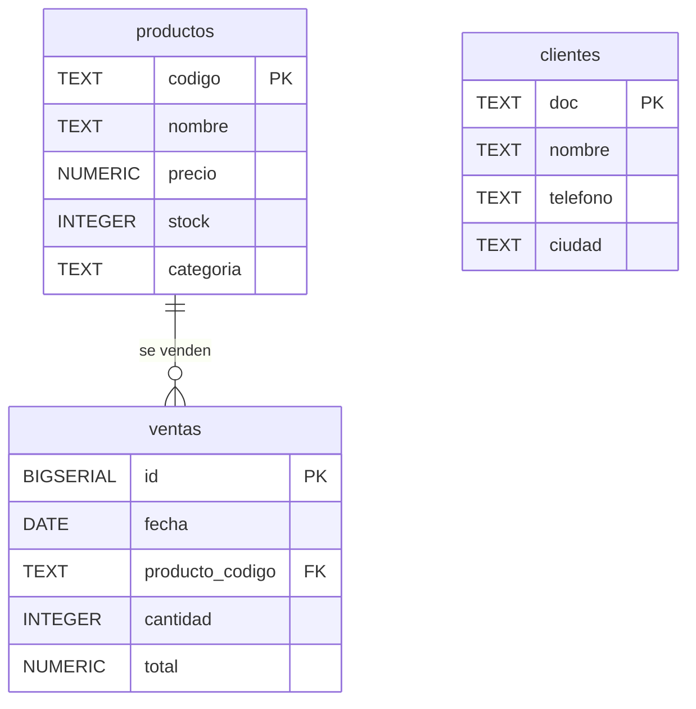

# 📘 Guía básica: Bases de datos, tablas, columnas y tipos de datos

## 🧱 ¿Qué es una **base de datos**?

Una **base de datos** es un contenedor donde guardamos información organizada para poder consultarla y modificarla fácilmente.

Piensa en ella como una **carpeta grande** que guarda varios archivos de información (las **tablas**). También puedes verla como un **un archivo de Excel** con múltiples pestañas (cada pestaña es una tabla diferente).

**Ejemplo:**

- Base de datos: `tienda_relampago`
  - Guarda todo lo relacionado con una tienda: productos, ventas, clientes, etc.

## 📄 ¿Qué es una **tabla**?

Una **tabla** es como una pestaña de excel que contiene información.
Cada tabla almacena **información de un solo tipo de entidad** (por ejemplo, productos o clientes).

**Ejemplo:**

- Tabla `productos` → guarda los productos que vende la tienda.
- Tabla `clientes` → guarda información de los compradores.
- Tabla `ventas` → guarda las transacciones realizadas.

Cada tabla tiene **filas** y **columnas**:

| codigo | nombre           | precio | stock | categoria |
| ------ | ---------------- | ------ | ----- | --------- |
| A-01   | Café molido 500g | 12.50  | 50    | alimentos |
| B-99   | Taza cerámica    | 18000  | 10    | hogar     |

- **Fila (row):** un registro (por ejemplo, un producto).
- **Columna (column):** un tipo de dato (por ejemplo, precio o categoría).

## 📊 ¿Qué es una **columna**?

Cada **columna** define un **campo de información** dentro de una tabla.
Además, tiene un **tipo de dato**, que le dice a PostgreSQL qué tipo de información puede almacenar.

**Ejemplo (de tabla `productos`):**

| Columna     | Tipo de dato    | Significado                |
| ----------- | --------------- | -------------------------- |
| `codigo`    | `TEXT`          | Identificador del producto |
| `nombre`    | `TEXT`          | Nombre del producto        |
| `precio`    | `NUMERIC(12,2)` | Precio con decimales       |
| `stock`     | `INTEGER`       | Cantidad disponible        |
| `categoria` | `TEXT`          | Tipo de producto           |

## 🔢 Tipos de datos más usados en PostgreSQL

Cada columna tiene un **tipo de dato**, que define el formato y las operaciones que se pueden hacer con ella.

| Tipo de dato           | Qué almacena                     | Ejemplo              | Comentario                                  |
| ---------------------- | -------------------------------- | -------------------- | ------------------------------------------- |
| `TEXT`                 | Texto libre                      | `'Café molido 500g'` | Se usa cuando el valor no es numérico       |
| `INTEGER`              | Números enteros                  | `10`, `-3`           | Ideal para cantidades, edades, etc.         |
| `NUMERIC(p,s)`         | Números con decimales            | `12.50`              | Se usa para precios o valores exactos       |
| `DATE`                 | Fechas                           | `'2025-11-04'`       | Permite comparar fechas y calcular días     |
| `BOOLEAN`              | Verdadero o falso                | `TRUE`, `FALSE`      | Usado para marcar condiciones               |
| `SERIAL` o `BIGSERIAL` | Números que se incrementan solos | `1, 2, 3...`         | Útil para crear identificadores automáticos |

**Ejemplo:**

```sql
CREATE TABLE productos (
  id SERIAL,
  nombre TEXT,
  precio NUMERIC(10,2),
  disponible BOOLEAN,
  fecha_ingreso DATE
);
```

## 🧩 ¿Qué son las **restricciones (constraints)**?

Las **restricciones** son reglas que garantizan que los datos sean correctos y coherentes.
Evitan errores como precios negativos o productos repetidos.

### 1. **PRIMARY KEY (llave primaria)**

Identifica **de forma única** cada fila en una tabla.
No puede repetirse ni estar vacía.

```sql
ALTER TABLE productos ADD CONSTRAINT productos_pkey PRIMARY KEY (codigo);
```

👉 Cada producto tendrá un código único.

### 2. **FOREIGN KEY (llave foránea)**

Crea una **relación entre dos tablas**.
Por ejemplo, una venta debe estar asociada a un producto que exista.

```sql
ALTER TABLE ventas
ADD CONSTRAINT ventas_producto_fk
FOREIGN KEY (producto_codigo)
REFERENCES productos(codigo);
```

👉 No puedes registrar una venta de un producto que no existe.

### 3. **CHECK**

Valida que un valor cumpla una condición lógica.

```sql
ALTER TABLE productos
ADD CONSTRAINT chk_precio_positivo CHECK (precio > 0);
```

👉 Evita precios iguales o menores a 0.

### 4. **DEFAULT**

Define un valor por defecto cuando no se indica uno.

```sql
ALTER TABLE productos
ALTER COLUMN stock SET DEFAULT 0;
```

👉 Si no se escribe un stock al crear el producto, se pondrá “0”.

### 5. **NOT NULL**

Obliga a que una columna **no pueda quedar vacía**.

```sql
ALTER TABLE clientes
ALTER COLUMN nombre SET NOT NULL;
```

👉 El nombre del cliente siempre debe tener un valor.

## 🧠 Diferencia entre Base de datos, Tablas y Columnas

| Nivel               | Qué representa                                   | Ejemplo                           | Analogía                       |
| ------------------- | ------------------------------------------------ | --------------------------------- | ------------------------------ |
| **Base de datos**   | Conjunto de todas las tablas y datos             | `tienda_relampago`                | Carpeta principal              |
| **Tabla**           | Conjunto de filas y columnas con datos similares | `productos`                       | Hoja de Excel                  |
| **Columna**         | Tipo de información dentro de una tabla          | `precio`                          | Encabezado de columna en Excel |
| **Fila (registro)** | Un elemento individual                           | `'A-01', 'Café molido', 12.50...` | Una fila con datos concretos   |

## 🧮 Ejemplo visual completo

**Base de datos:** `tienda_relampago`
**Tablas:** `productos`, `ventas`, `clientes`



## 💡 En resumen

- **Base de datos:** almacena todo.
- **Tablas:** agrupan información por tipo.
- **Columnas:** definen qué datos guarda cada fila.
- **Tipos de datos:** especifican el formato de los valores.
- **Restricciones:** aseguran que los datos sean correctos y consistentes.
